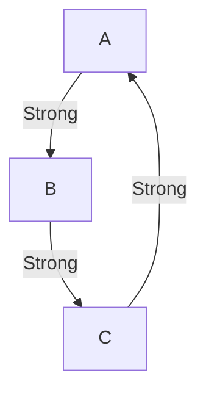

# Smart Pointer

- [`Box<T>`](#boxt)
    - [Recursive Types](#recursive-types)
- [`RefCell<T>`](#refcellt)
    - [Interior Mutability Pattern](#interior-mutability-pattern)
    - [Thread Safety](#thread-safety)
- [`Rc<T>`](#rct)
    - [Mutability](#mutability)
    - [Reference Cycle](#reference-cycle)
    - [Thread Safety](#thread-safety-1)

## `Box<T>`
`Box<T>` is similar to C++'s `std::unique_ptr`; allocates a value on the heap and takes full ownership of the value:
```rust
let ptr = Box::new(10);
println!("{}", ptr);    // 10
```

`Box<T>` uses move semantics just like `std::unique_ptr`:
```rust
let ptr = Box::new(10);
let ptr2 = ptr;         // move `ptr` into `ptr2`
println!("{}", ptr);    // compile error: borrow of moved value: `ptr`
```

The internal value can be retrieved by using deref (`*`):
```rust
let ptr = Box::new(10);
println!("{}", *ptr + 5);   // 15
```

### Recursive Types
`Box<T>` can be used to fix recursive types (types that include itself as a member):
```rust
struct Foo {
    another: Foo        // compile error: recursive type `Foo` has infinite size
}

struct Bar {
    another: Box<Bar>   // OK
}
```

## `RefCell<T>`
`RefCell<T>` is similar to `Box<T>`, however the borrow rule is checked at runtime. For example, multiple mutable borrow on `Box<T>` will lead to compile error (borrow rules checked at compile time for `Box<T>`):
```rust
let mut ptr = Box::new(10);
let first_borrow: &mut i32 = ptr.borrow_mut();
let second_borrow: &mut i32 = ptr.borrow_mut();
*first_borrow += 10;    // compile error: cannot borrow `ptr` as mutable more than once at a time
```

With `RefCell<T>` the borrow rule is checked at runtime, which will cause program to panic if multiple mutable borrow detected:
```rust
let ptr = RefCell::new(10);
let first_borrow = ptr.borrow_mut();
let second_borrow = ptr.borrow_mut();       // panic: already borrowed: BorrowMutError
```
This runtime check will incur a runtime performance cost.

### Interior Mutability Pattern
The benefit of `RefCell<T>` is that the internal value can be mutated even though the `RefCell<T>` is immutable:
```rust
let ptr = RefCell::new(10);
*ptr.borrow_mut() += 10;
print!("{}", ptr.borrow());     // 20
```
This is good for cases such as when we want to have a data structure with some members that can be mutated internally, but when seen externally they are immutable.

### Thread Safety
`RefCell<T>` is not thread safe, for multi-thread environments use `Mutex<T>` or `RwLock<T>`.

## `Rc<T>`
`Rc<T>` is similar to C++'s `std::shared_ptr`; allocates a value on the heap and share ownership between multiple smart pointers using reference counting:
```rust
let ptr = Rc::new(10);
let ptr2 = Rc::clone(&ptr);
let ptr3 = Rc::clone(&ptr);
let ptr4 = Rc::clone(&ptr3);
println!("value = {}, ref count = {}", ptr, Rc::strong_count(&ptr));    // value = 10, ref count = 4
```

### Mutability
`Rc<T>` only stores immutable values (values cannot be mutated after storing in `Rc<T>`), however this restriction can be lifted using `Rc<RefCell<T>>`:
```rust
let value = Rc::new(RefCell::new(10));
*value.borrow_mut() += 10;
println!("{}", value.borrow());     // 20
```

### Reference Cycle
Use `Weak<T>` to indicate a "weak reference", this is similar to C++'s `std::weak_ptr`. `Rc<T>` can create a `Weak<T>` using `downgrade()`:
```rust
let ptr = Rc::new(10);
let ptr2 = Rc::clone(&ptr);
let ptr3 = Rc::clone(&ptr);
println!("strong = {}, weak = {}", Rc::strong_count(&ptr), Rc::weak_count(&ptr));   // strong = 3, weak = 0

let weak = Rc::downgrade(&ptr2);
println!("strong = {}, weak = {}", Rc::strong_count(&ptr), Rc::weak_count(&ptr));   // strong = 3, weak = 1
```
A "weak reference" will not increase the strong reference count for `Rc<T>`. This is useful for breaking cyclic references:

Using a weak reference anywhere in the cycle will break the cycle and allowing strong reference count to reach 0.

### Thread Safety
`Rc<T>` is not thread safe, for multi-thread environments use `Arc<T>`
